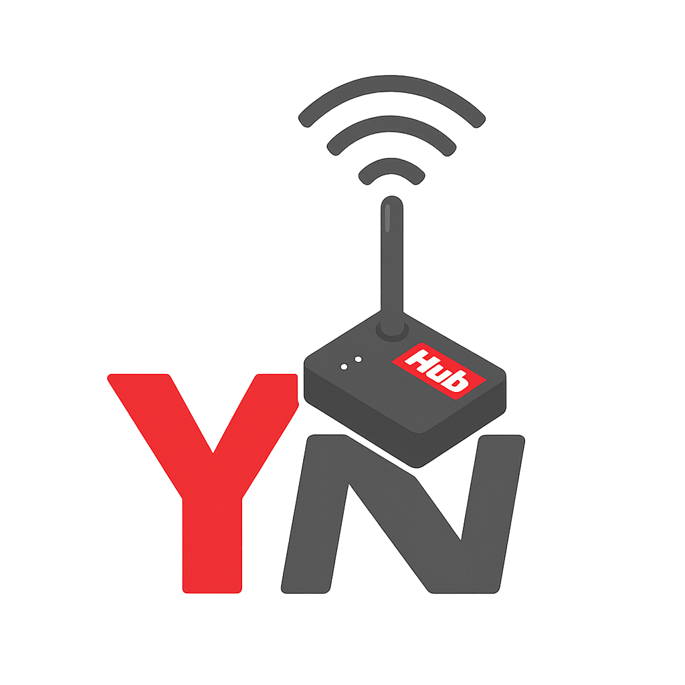

  

# 🧰 Yokis Hub Connect pour Home Assistant

**Connecteur non officiel entre le Yokis Hub et Home Assistant.**  
Ce projet permet de piloter vos volets, lumières et interrupteurs via de simples commandes REST.  
Il inclut des exemples prêts à copier dans `configuration.yaml`, des capteurs REST et un guide d’installation complet.

---

## ✨ Fonctionnalités
- ✅ Commandes REST pour volets (covers), lumières et interrupteurs  
- 📡 Lecture périodique de l’état via `server.xml`  
- 🧭 Exemples complets pour `configuration.yaml`  
- 🔐 Utilisation de `secrets.yaml` pour sécuriser vos identifiants  
- 📘 Documentation claire et accessible

---

## 🚀 Mise en route rapide
1. Copiez les blocs YAML depuis la [documentation](./docs/configuration.md) dans votre `configuration.yaml`.  
2. Modifiez `secrets.yaml` avec :
   - l’**IP de votre Yokis Hub**  
   - votre **token Basic Auth**  
   - les **UIDs de vos modules** (volets, lumières, etc.)  
3. Redémarrez Home Assistant 🏡 
4. Contrôlez vos équipements Yokis directement depuis l’interface 🎉

---

## 📝 Prérequis
- Un **Yokis Hub** fonctionnel sur votre réseau local  
- Votre identifiant (email) + mot de passe ou **token HTTP Basic**  
- Les **UIDs** de vos modules (récupérables via `server.xml` ou sniff réseau)

---

## ⚠️ Avertissement
Ce projet est une **intégration non officielle**, obtenue par ingénierie inverse du protocole HTTP du Yokis Hub.  
Il n’est pas affilié à Yokis. Utilisation à vos risques et périls.  
Yokis est une marque déposée appartenant à ses propriétaires respectifs.

---

## 📄 Licence
MIT © 2025 [LeoBrg34](https://github.com/LeoBrg34)
