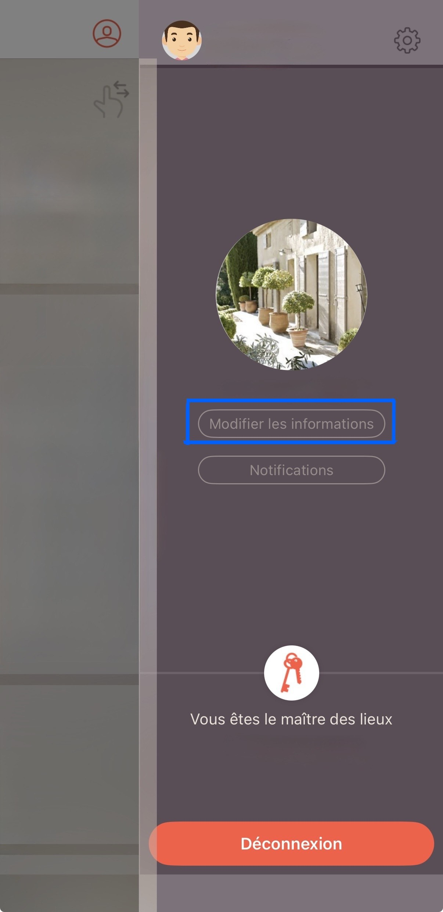

# 🔎 Trouver l’IP locale de votre Yokis Hub

Ce guide vous montre comment **trouver l’adresse IP locale** de votre Yokis Hub depuis l’application **YNO**.

> 📸 Les captures d’écran ci-dessous proviennent d’**Android**. L’interface iOS peut différer légèrement.

---

## ✅ Prérequis
- Être **connecté au même réseau Wi-Fi** que votre Yokis Hub
- Avoir l’**application YNO** installée et **connectée à votre compte**

---

## 🪄 Étapes (méthode YNO)

1) **Connectez-vous à votre Yokis Hub** via l’app **YNO** (avec votre compte).

<p>
  
</p>

2) Ouvrez **Paramètres** → **Modifier les informations**.  
3) Faites défiler la page : **l’adresse IP locale** du Hub apparaît en **bas de page**.

<p>
  
</p>

> ✨ L’adresse IP est au format `192.168.x.x` ou `10.x.x.x`.

---

## 💡 Si l’app ne montre pas l’IP

**Option A — Routeur / Box Internet**  
- Ouvrez l’interface de votre box, rubrique **Appareils connectés** / **DHCP**  
- Cherchez un appareil nommé *Yokis Hub*, *Yokis*, ou similaire  
- Relevez l’IP attribuée (ex. `192.168.0.156`)

**Option B — Depuis un ordinateur (même réseau)**  
- **Windows (PowerShell)**
  ```powershell
  arp -a
